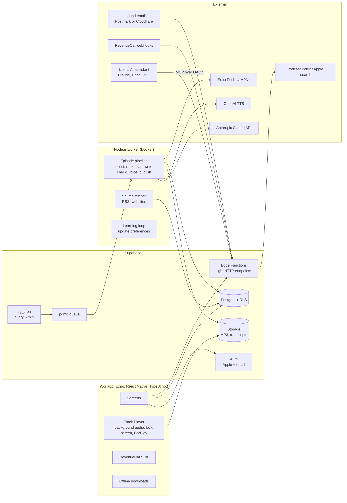
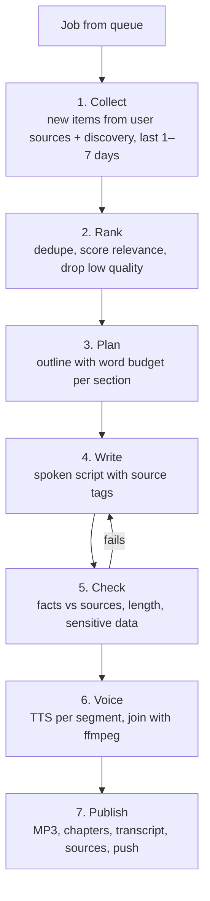

# Briefcast — Architecture, Data Model and Screens

Status: **Draft for approval.** No app code has been written yet.
Working name: Briefcast. The name will live in one file: `packages/shared/src/config/app.ts`.

---

## 0. Before we build: what I would challenge

These points change the plan. Please read them first.

### 0.1 The biggest risk is episode quality, not the code
The app works only if people listen **every day**. That depends on script quality: is it personal, is
it smart, is it the right length. Code for the player and onboarding is well-known work. The
episode is not.

**What I will do:** build the generation pipeline **first** (as a command-line tool) and make real
episodes for you before building most screens. You listen for 1–2 weeks. We fix the prompts. Then we
build the rest. This is the cheapest way to find out if the product is good.

### 0.2 The $0.50 per 20-minute episode target rules out some providers
A 20-minute episode is about 3,200 words, or about 19,000 characters of text for voice.

| Part | Option | Rough cost for 20 min (please verify current prices) |
|---|---|---|
| Voice (TTS) | OpenAI TTS (`gpt-4o-mini-tts` / `tts-1`) | about $0.25–0.30 |
| Voice (TTS) | ElevenLabs | about $2–5 (too expensive for the target) |
| Plan + write | Claude Sonnet | about $0.10–0.15 (lower with prompt caching) |
| Rank + check | Claude Haiku | about $0.02 |

**Decision:** OpenAI TTS is the default. ElevenLabs stays in config as a "premium voice" option for
later (for example, a higher price plan). Voice is ~65% of the cost, so it is the lever to watch.

### 0.3 Supabase alone cannot run the episode job
Supabase Edge Functions have short time limits and no `ffmpeg`. One episode needs several LLM calls,
many TTS calls, and audio joining. That takes 2–5 minutes.

**Decision:** Supabase for auth, database, storage, cron and the queue (`pgmq`). **One small Node.js
worker** (a Docker container on Fly.io, Railway or Google Cloud Run) runs the pipeline. Still simple,
still mostly managed.

### 0.4 Some source types are legally or technically weak
- **Podcast transcripts:** most shows do not publish them. Making our own transcripts from their audio
  is a copyright risk and costs money. **MVP uses title + show notes only.** If a feed includes a
  `podcast:transcript` tag, we use it.
- **YouTube transcripts:** the official API does not give transcripts for other people's videos.
  Scraping breaks YouTube's terms. **Moved to v2** (already outside your MVP list — good).
- **Newsletters forwarded by the user:** fine for personal use. We must strip tracking links and
  "unsubscribe" links (they contain the user's personal tokens) and never share this content across users.

### 0.5 CarPlay needs Apple approval — start now
A CarPlay audio app needs a special entitlement from Apple. Approval can take weeks. **Action for you:**
request the "CarPlay audio" entitlement in the Apple Developer account this week. Until then, audio
still plays in the car through the normal lock-screen / Bluetooth controls.

### 0.6 The MVP is still big — what I would cut or delay
| Item | Recommendation | Why |
|---|---|---|
| Voice note in feedback | Text only in v1 | Needs recording + transcription; low use at first |
| Private RSS feed | v1.1 | Nice, not core. Also weakens the in-app feedback loop |
| Other episode languages | Build the setting, ship English + 2–3 languages | Every language needs quality checks |
| MCP connector | Right after v1 (as you said) | Copy-paste gives 80% of the value on day one |
| CarPlay templates | After Apple approves | Depends on Apple |

### 0.7 Competition and positioning
AI-native competitors already make audio from content (for example NotebookLM audio overviews,
ElevenLabs Reader, and new "personal daily podcast" startups). The technology is not the moat.
**The moat is: personal context + the learning loop + the "one idea and one question" format.**
So the feedback loop and the "what changed" line are not extras — they are the product.

### 0.8 A question for you as an operator
Is this a Travelier product, a separate venture, or an internal tool for leaders first? The answer
changes the first users, the brand, and how much we spend on App Store polish vs. learning speed.
My suggestion: **start as an internal tool for 10–20 Travelier leaders on TestFlight** — real users,
fast feedback, zero marketing cost — then go to the public App Store.

---

## 1. Architecture

### 1.1 Overview



### 1.2 Components

| Component | Tech | Job |
|---|---|---|
| Mobile app | Expo (SDK latest), TypeScript, Expo Router, `react-native-track-player`, TanStack Query, Zustand | All screens, player, downloads |
| Auth | Supabase Auth | Sign in with Apple, email one-time code |
| Database | Supabase Postgres with Row Level Security | All data. Users can only read their own rows |
| Storage | Supabase Storage (private bucket, signed URLs) | MP3 files, voice previews |
| Scheduler | `pg_cron` every 5 minutes | Finds users whose episode is due in the next ~60 min and adds a job |
| Queue | Supabase Queues (`pgmq`) | Jobs with retries and a "dead letter" state |
| Worker | Node.js 22 + TypeScript, `ffmpeg`, Docker | Runs the pipeline, fetches sources, updates preferences |
| Light API | Supabase Edge Functions (Deno) | Podcast search, inbound email webhook, RevenueCat webhook, account deletion, "generate now", MCP server |
| LLM | Anthropic Claude (Sonnet to plan/write, Haiku to rank/check/scrub) | Models set in config |
| Voice | OpenAI TTS (default), ElevenLabs (optional) | Provider set in config |
| Payments | RevenueCat + StoreKit 2 | 7-day trial, monthly and yearly |
| Push | Expo Notifications → APNs | "Your episode is ready" |
| Analytics | PostHog (EU or US cloud), no personal data in events | Listen-through, feedback rate, retention |
| Errors | Sentry (app + worker), with PII scrubbing | Crash and error reports |

### 1.3 Repository layout (monorepo, pnpm workspaces)

```
/apps/mobile                Expo app
/services/worker            Node.js pipeline worker (Docker)
/supabase/migrations        SQL schema, RLS policies, cron jobs
/supabase/functions         Edge Functions (search, webhooks, delete-account, mcp)
/supabase/seed              Topic categories, discovery sources, voices
/packages/shared            Shared types, zod schemas, config
  /src/config/app.ts        App name, prices, trial days, support email
  /src/config/ai.ts         Models, TTS provider, voices, words-per-minute
  /src/config/limits.ts     Cost targets, lengths, lookback days
/docs                       Architecture, privacy policy draft, terms draft, App Store notes
README.md
```

### 1.4 The episode pipeline (worker)

Each step saves its output to the database, so a failed job restarts from the last good step, not
from zero.



**1. Collect.** The worker fetches RSS feeds on a shared schedule (one fetch per feed, not per user).
For the job, it reads items from the user's sources plus discovery sources that match their interests.
Lookback: 1 day for daily users, up to 7 days for weekly users.

**2. Rank.** Cheap scoring first, LLM second:
- Remove duplicates (URL + content hash, and near-duplicate titles).
- Score = topic match (embedding similarity to weighted interests) × source trust × freshness,
  minus "avoid" topics and topics used in the last 14 days.
- Haiku reviews the top ~40 items and picks the best 8–15, with one line on why each matters to this user.

**3. Plan.** Sonnet gets: episode type, format, target words (`minutes × wpm for the chosen voice`),
the user's context, the feedback summary, and the ranked items. It returns JSON: title, sections, each
with main idea, source IDs, word budget, and question. Mix = 3–5 ideas + "pick one". Deep dive = one
idea: facts → counter-argument → what it means for you → options with tradeoffs → questions.

**4. Write.** Sonnet writes the script section by section in simple spoken English (short sentences,
common words, CEFR B1–B2 level). Every fact carries a hidden tag like `[S12]`. Conversation format
uses labels `HOST_A:` / `HOST_B:` and must include at least one real disagreement.

**5. Check.** Haiku (or Sonnet for deep dives) checks:
- Every tagged claim is supported by the source text. Unsupported claims are removed or rewritten.
- No quote longer than ~25 words; every quote names its source.
- Word count is within ±10% of target. If not, rewrite only the long or short section.
- No sensitive data from the profile is spoken (for example, names of family, exact revenue numbers the user shared).

**6. Voice.** Remove tags. Send each section to TTS (in parallel, with limits). For conversations,
each speaker turn uses its own voice. `ffmpeg` joins: intro sound + sections + outro, and normalizes
loudness to podcast standard (−16 LUFS). We measure the real length of each section, so **chapter
times are exact**, not guessed. We also learn the real words-per-minute for each voice and use it next time.

**7. Publish.** Upload MP3 to storage. Save chapters, transcript, and source list. Mark episode as
ready. Send the push. Write the cost log.

**First episode on day one:** the app calls the "generate now" function at the end of onboarding. It
skips the schedule and goes to the front of the queue. Target time: under 4 minutes. The app shows a
progress screen with the step names. If the user added few sources, discovery sources fill the gap.

**Cost control:** every LLM and TTS call writes a row to `cost_log` (tokens, characters, dollars).
A daily query shows cost per episode and per minute. If an episode goes over a hard limit (in config),
the job stops and alerts us.

### 1.5 Scheduling and time zones
- Settings store local time + IANA time zone (for example `Asia/Bangkok`). This handles daylight saving time.
- Every 5 minutes, `pg_cron` finds users where the next delivery time is within the "lead time" (default
  60 min) and no episode exists yet for that slot, and adds a job. A unique key on
  `(user_id, scheduled_for)` stops double episodes.
- If a job fails 3 times, the user gets the episode late with a softer push, or a "we could not make
  today's episode" message. We never send a bad episode.
- Users with no active subscription or trial do not get scheduled jobs.

### 1.6 Personal context and privacy
- **Three ways in:** copy-paste prompt, MCP connector, manual edit. All three write to the same
  `listener_context` table and keep a version history (last 10 versions).
- **Scrub before store:** regex rules (card numbers, IBAN, passport/ID patterns, phone, email) +
  a Haiku pass for health and other sensitive data. The user sees what was removed.
- **Encryption:** the context text is encrypted with AES-256-GCM in the worker/Edge Function before
  it is saved. The key lives in secrets (Supabase Vault or cloud KMS), not in the database. Only the
  worker and the user's own API calls can decrypt it.
- **No training:** Anthropic and OpenAI API data is not used for training by default. We state this
  in the privacy policy, and we do not use user data to train our own models.
- **No personal data in logs:** a logger wrapper removes context, scripts and emails from logs. Logs
  use user IDs only.
- **Delete everything:** one button. It deletes the auth user, which cascades to all rows, and a job
  removes all storage files and the inbound email address. Done within minutes, confirmed in the app.

### 1.7 MCP connector (ships right after v1)
- A remote MCP server (Streamable HTTP) as an Edge Function at `https://mcp.<domain>/`.
- OAuth 2.1 with PKCE and dynamic client registration, as the MCP spec asks. The user logs in with
  their Briefcast account and approves access.
- Tools:
  - `update_listener_profile(profile_text, mode: "replace" | "append")` → goes through the same
    scrub + encrypt path.
  - `get_recent_episodes(limit)` → titles, main ideas, star rating and thumbs per idea. No audio, no full transcripts.
- The user can see and revoke connected assistants in the app.

### 1.8 Newsletter forwarding
- Each user gets `firstname-7k3p@in.<domain>` (random part, not guessable).
- Inbound email provider (Postmark Inbound or Cloudflare Email Routing) posts to an Edge Function.
- We verify the sender signature, remove tracking/unsubscribe links and footers, save a short summary
  and the key text as a **private** source item for that user only.
- We detect "confirm your subscription" emails and show them in the app with a "Confirm" button.

### 1.9 Subscriptions
- RevenueCat with one entitlement: `pro`. Products: monthly, yearly, both with a 7-day free trial.
  Prices and product IDs in `config/app.ts`.
- RevenueCat webhook → Edge Function → `subscriptions` table. The scheduler reads this table.
- **Paywall placement (my recommendation):** after the first episode is made, not before. The user
  hears the value, then starts the trial. Alternative: paywall at the end of onboarding (more trial
  starts, but people pay before they see value).

---

## 2. Data model

All tables have `created_at` and `updated_at`. All user tables have RLS: `user_id = auth.uid()`.
Deleting a user cascades to every table below.

### 2.1 Users and settings

**`profiles`** — one row per user
| Column | Type | Notes |
|---|---|---|
| user_id | uuid PK → auth.users | |
| display_name | text | |
| time_zone | text | IANA name |
| app_language | text | UI language, default `en` |
| onboarding_done_at | timestamptz | null until done |
| ai_disclosure_seen_at | timestamptz | App Store requirement |

**`podcast_settings`** — one row per user
| Column | Type | Notes |
|---|---|---|
| user_id | uuid PK | |
| frequency | enum `weekdays` / `daily` / `custom` | |
| custom_days | smallint[] | 1 = Monday … 7 = Sunday |
| delivery_time | time | local time |
| length_minutes | smallint | 5, 10, 15, 20, 25, 30 |
| format | enum `solo` / `conversation` | |
| voice_a_id / voice_b_id | text → `voices.id` | voice_b only for conversation |
| episode_type | enum `mix` / `deep_dive` | default `mix` |
| tone | enum `direct` / `calm` | |
| episode_language | text | default `en` |
| auto_download_wifi | boolean | default true |

**`listener_context`** — what the app knows about the user
| Column | Type | Notes |
|---|---|---|
| id | uuid PK | |
| user_id | uuid | |
| ciphertext | bytea | encrypted profile text |
| key_version | smallint | for key rotation |
| origin | enum `paste` / `mcp` / `manual` | |
| removed_items | jsonb | types of data removed by the scrubber (not the data itself) |
| is_current | boolean | only one current row per user |

### 2.2 Interests and sources

**`topic_categories`** (seed) — `id`, `name`, `parent_id`, `sort`
Examples: AI, Leadership, Markets, Travel industry, Product, Strategy, Health & performance…

**`interests`**
| Column | Type | Notes |
|---|---|---|
| id | uuid PK | |
| user_id | uuid | |
| category_id | uuid null | null for free-text topics |
| label | text | |
| user_weight | enum `a_lot` / `some` / `a_little` / `avoid` | what the user chose |
| learned_weight | real | changed by feedback, range 0–2, starts at 1 |
| embedding | vector(…) | pgvector, for matching items |

**`sources`** — shared catalog, one row per real feed
| Column | Type | Notes |
|---|---|---|
| id | uuid PK | |
| kind | enum `podcast` / `rss` / `website` / `newsletter_email` / `youtube` / `book` | |
| title, url, feed_url, image_url | text | |
| external_id | text | Podcast Index ID, Apple ID, ISBN |
| is_discovery | boolean | part of our curated list |
| discovery_categories | uuid[] | for discovery sources |
| last_fetched_at, fetch_error | | |

**`user_sources`**
| Column | Type | Notes |
|---|---|---|
| user_id, source_id | PK | |
| added_by | enum `user` / `system` | user-added ranks higher |
| trust | real | starts 1.0 (user) or 0.6 (system); changed by feedback |
| muted | boolean | |

**`inbound_addresses`** — `user_id`, `address` (unique), `active`

**`source_items`** — one row per article / episode / email
| Column | Type | Notes |
|---|---|---|
| id | uuid PK | |
| source_id | uuid | |
| owner_user_id | uuid null | set only for private items (forwarded newsletters) |
| title, url, author | text | |
| published_at | timestamptz | |
| summary | text | short, from feed or our summary |
| body_excerpt | text | cleaned text used for fact checking; kept 30 days, then deleted |
| content_hash | text | for dedupe |
| embedding | vector | for ranking |

### 2.3 Episodes

**`episodes`**
| Column | Type | Notes |
|---|---|---|
| id | uuid PK | |
| user_id | uuid | |
| status | enum `queued` / `collecting` / `ranking` / `planning` / `writing` / `checking` / `voicing` / `ready` / `failed` | |
| scheduled_for | timestamptz | unique with user_id |
| trigger | enum `schedule` / `first` / `deep_dive_request` / `manual` | |
| deep_dive_of_segment_id | uuid null | when the user asked "go deeper" |
| episode_type, format, tone, language | | copied from settings at run time |
| target_seconds, actual_seconds | int | |
| title, summary | text | |
| change_note | text | "More leadership, fewer market updates, as you asked." |
| audio_path | text | storage path |
| transcript | jsonb | speaker turns with times |
| plan | jsonb | saved for retries and debugging |
| cost_usd | numeric | total |
| error | text | no personal data |
| published_at | timestamptz | |

**`episode_segments`** — one per idea = one chapter
| Column | Type | Notes |
|---|---|---|
| id | uuid PK | |
| episode_id | uuid | |
| idx | smallint | order |
| kind | enum `intro` / `idea` / `recap` / `questions` | |
| title, main_idea, question | text | |
| topic_tags | text[] | for the 14-day "do not repeat" rule |
| start_sec, end_sec | real | exact, from audio |

**`episode_sources`** — which items support which segment
`episode_id`, `segment_id`, `source_item_id`, `short_quote` (optional, max ~25 words)

**`cost_log`** — `episode_id`, `step`, `provider`, `model`, `input_tokens`, `output_tokens`,
`characters`, `usd`, `created_at`

### 2.4 Feedback and learning

**`feedback`**
| Column | Type | Notes |
|---|---|---|
| id | uuid PK | |
| episode_id, user_id | uuid | one per user per episode (can be edited) |
| stars | smallint 1–5 | |
| quick_tags | text[] | `too_long`, `too_short`, `too_basic`, `too_technical`, `too_much_news`, `not_about_my_work` |
| note | text | "What should be different next time?" |

**`segment_feedback`** — `feedback_id`, `segment_id`, `thumb` (−1 / +1), `go_deeper` (bool)

**`preference_state`** — one row per user, updated after each feedback
| Column | Type | Notes |
|---|---|---|
| user_id | uuid PK | |
| depth | real | −1 basic … +1 expert |
| news_vs_ideas | real | |
| work_relevance | real | how strongly to connect to their job |
| length_bias_seconds | int | small change if they keep saying "too long" |
| planner_summary | text | short text the planner reads: liked / disliked / asked for |
| last_change_note | text | shown on the next episode |

How the loop works (simple and visible, no black box):
1. Thumbs up/down on a segment → change `learned_weight` of matching interests and `trust` of the
   sources used (small steps, with limits so one bad day does not ruin the profile).
2. Quick tags → change `depth`, `news_vs_ideas`, `work_relevance`, `length_bias_seconds`.
3. "Go deeper" → create a `deep_dive_request` episode for the next slot.
4. Haiku rewrites `planner_summary` from the last ~10 feedbacks (max ~150 words) and writes the
   one-line `change_note`.

### 2.5 Other tables
- **`voices`** (seed) — `id`, `provider`, `provider_voice_id`, `name`, `gender`, `languages`,
  `preview_path`, `words_per_minute`
- **`listen_events`** — `user_id`, `episode_id`, `event` (`start` / `progress` / `complete` /
  `chapter_jump` / `speed_change`), `position_sec`, `at`. Used for listen-through rate.
- **`episode_reports`** — `episode_id`, `user_id`, `reason` (`wrong_fact` / `harmful` / `other`),
  `note`, `status`. Sends an alert to us.
- **`subscriptions`** — `user_id`, `rc_app_user_id`, `entitlement`, `status`, `period`,
  `trial_ends_at`, `expires_at`
- **`push_tokens`** — `user_id`, `expo_token`, `platform`
- **`mcp_grants`** — `user_id`, `client_name`, `scopes`, `token_hash`, `last_used_at`, `revoked_at`

---

## 3. Screens

Design rules: calm colors, large text (min 17 pt body, Dynamic Type supported), buttons at least
56 pt tall, one main action per screen, dark mode, VoiceOver labels on every control.

### 3.1 Start and sign-in
1. **Welcome** — one sentence about the product, "Continue with Apple", "Continue with email".
2. **Email sign-in** — email, then 6-digit code (no passwords).

### 3.2 Onboarding (each step has "Skip")
3. **Interests** — category chips; tap once = "some", twice = "a lot", long-press for "a little";
   free-text "Add a topic"; "Topics to avoid" section.
4. **Sources** — tabs: Podcasts (search), Websites & RSS (paste URL), Newsletters (your forwarding
   address + copy button + short guide), Books (title search).
5. **About you** — "Copy this prompt" button + 3-step guide for Claude / ChatGPT / Gemini, big paste
   box, or "Type it myself". Shows what the scrubber removed.
6. **Your podcast** — frequency and days, delivery time, length, format, voice(s) with 10-second
   preview, episode type, tone, language. Good defaults so the user can just tap "Next".
7. **Notifications** — why we ask, then the iOS prompt.
8. **Making your first episode** — progress steps ("Reading your sources… Writing… Recording…"),
   about 3–4 minutes. AI disclosure shown here: "Episodes and voices are made by AI."
9. **Paywall** — shown after the first episode is ready (see 1.9). 7-day free trial, monthly / yearly,
   restore purchases, links to terms and privacy.

### 3.3 Main app (3 tabs)
10. **Today** — latest episode as a big card with play button, the "what changed" line, chapter list
    preview, "Give feedback" button. If generating: progress state.
11. **Library** — list of episodes, search (title, ideas, transcript), downloaded filter.
12. **You** — entry to profile, interests, sources, podcast settings, account.

### 3.4 Player and episode
13. **Player (full screen)** — play/pause, skip back 15 / forward 30, speed (0.8–2x), chapter title,
    progress bar with chapter marks, buttons: Chapters, Transcript, Sources, Feedback. Mini-player
    stays on other screens.
14. **Chapters** — list, tap to jump; each has "Go deeper on this".
15. **Transcript** — follows the audio, tap a line to jump there.
16. **Sources** — list per chapter, source name + link to the original.
17. **Feedback (sheet)** — stars, thumbs per idea, "Go deeper" per idea, quick-option chips, optional
    text. Under 20 seconds. Opens when an episode ends, and from Library.
18. **Report a problem** — reason + note.

### 3.5 Profile and settings
19. **What the app knows about you** — the profile in plain language, edit, delete, version history,
    "Connect your AI assistant" (MCP, after v1).
20. **Interests** (same as onboarding step 3, with learned weights shown as simple arrows ↑ ↓).
21. **Sources** (manage, mute, remove; system-added sources marked as "Suggested").
22. **Podcast settings** (same as step 6).
23. **Account** — subscription status, manage subscription, restore purchases, notifications, downloads
    and storage, delete my data, delete my account.
24. **About & legal** — privacy policy, terms (drafts marked "needs legal review"), AI disclosure,
    how we use your data, contact support.

---

## 4. Build plan (small steps)

Each step ends with: what works, what does not work yet, how to test.

| Step | What | How you test |
|---|---|---|
| 1 | Monorepo, config files, Supabase schema + RLS + seed data | Run migrations locally, run RLS tests |
| 2 | **Pipeline as a CLI** (RSS collect → rank → plan → write → check → TTS → MP3) | `pnpm episode --profile you.json` makes a real MP3 you can listen to |
| 3 | Quality round: you listen for a few days, we tune prompts and length control | Your feedback |
| 4 | App shell: sign-in, onboarding, settings saved to Supabase | Expo dev build on your iPhone |
| 5 | Player: background audio, lock screen, chapters, speed, transcript, sources, offline | Play an episode from step 2 |
| 6 | Queue + worker deploy + scheduler + push + "first episode now" | Set time to 5 min from now, get a push |
| 7 | Feedback screen + learning loop + "what changed" line | Give feedback, see the next episode change |
| 8 | Podcast search + newsletter forwarding | Forward a newsletter, see it in sources |
| 9 | RevenueCat, paywall, account deletion, legal drafts, privacy labels, AI disclosure, reports | Sandbox purchase on TestFlight |
| 10 | Analytics + cost dashboard + Sentry | Check events and cost per episode |
| 11 | TestFlight for 10–20 internal users, then App Store submission | Real usage |
| 12 | MCP connector | Connect from Claude, update profile |

Note: this cloud workspace cannot run the iOS simulator. I will write tests for the backend and
worker and run them here. For the app, you (or a teammate) run the Expo dev build on an iPhone with the
steps I give in the README.

---

## 5. What I need from you

1. **Approval** of this plan, or changes.
2. **Answers:**
   - Is it OK to build the pipeline CLI first (step 2) before the app screens?
   - OpenAI TTS as the default voice provider? (ElevenLabs does not fit the $0.50 target.)
   - Paywall after the first episode (my pick) or at the end of onboarding?
   - First users: internal Travelier leaders on TestFlight, or public launch?
3. **Accounts and keys** (can come later, before step 2 and step 4):
   - Anthropic API key, OpenAI API key (for TTS and embeddings)
   - Supabase project
   - A domain for the newsletter address (for example `in.briefcast.app`)
   - Apple Developer account (and request the CarPlay audio entitlement now)
   - RevenueCat account, Podcast Index API key (free)
